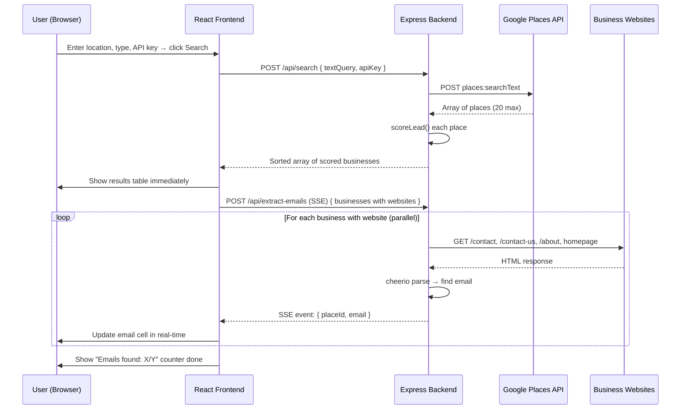

# Lead Generation Tool — Full Implementation Plan

A professional lead finder web app for a marketing & web design agency. It searches Google Places, scores businesses by online presence weakness, auto-crawls websites for emails, and exports results as CSV.

---

## User Review Required

> [!IMPORTANT]
> The Google Places API key you provided (`AlzaSyDLmEWddPoa-o1cF3q-kWOfbCiu_iaEAvw`) will be used as the **default prefilled value** in the UI input field. Users can override it. It will **never be hardcoded** into the backend.

> [!WARNING]
> Email crawling may be blocked by some websites (Cloudflare protection, bot detection). The tool handles this gracefully — those businesses return `null` for email silently.

> [!CAUTION]
> Two files were already partially created during the initial build attempt (`leadScorer.js`, `emailExtractor.js`). The plan includes overwriting them with finalized versions during execution.

---

## Open Questions

> [!IMPORTANT]
> **Agency Name**: What is your agency name to display in the header? (e.g., "LeadFinder by XYZ Agency") — I'll use `"LeadFinder Pro"` as default if not specified.

> [!NOTE]
> The project currently has a `client/` and `server/` structure. Should the React client use **Vite** (recommended, fast) or **Create React App**? → Defaulting to **Vite + React**.

---

## Architecture Overview

```
lead-finder/
├── client/                          ← React + Tailwind (Vite)
│   ├── public/
│   ├── src/
│   │   ├── components/
│   │   │   ├── SearchForm.jsx       ← Location, type, API key inputs
│   │   │   ├── ResultsTable.jsx     ← Main results grid with email states
│   │   │   ├── LeadBadge.jsx        ← 🔥⚡❄️ colored badge component
│   │   │   ├── FilterBar.jsx        ← All/Hot/Warm/Cold + toggles
│   │   │   └── ExportButton.jsx     ← CSV download trigger
│   │   ├── App.jsx                  ← Root: state, API calls, orchestration
│   │   ├── main.jsx
│   │   └── index.css                ← Tailwind + custom design tokens
│   ├── index.html
│   ├── vite.config.js
│   ├── tailwind.config.js
│   └── package.json
│
├── server/
│   ├── routes/
│   │   └── places.js                ← /api/search + /api/extract-emails
│   ├── utils/
│   │   ├── leadScorer.js            ← Scoring logic (100pt system)
│   │   └── emailExtractor.js        ← Axios + Cheerio crawling
│   ├── index.js                     ← Express server, CORS, routes
│   └── package.json
│
└── README.md
```

---

## Proposed Changes

### 1. Backend — Express Server

#### [MODIFY] server/utils/leadScorer.js
*(was partially created — will be overwritten with final version)*

- `scoreLead(place)` function
- Scoring: No website (+25), Rating < 3.5 (+20), Reviews < 5 (+20), Photos < 3 (+15), No phone (+10), No hours (+10)
- Returns `{ score, label, emoji, breakdown }`
- Labels: 🔥 Hot (60–100), ⚡ Warm (35–59), ❄️ Cold (0–34)

#### [MODIFY] server/utils/emailExtractor.js
*(was partially created — will be overwritten with final version)*

- `extractEmail(websiteUrl)` — crawls `/contact`, `/contact-us`, `/about`, `/about-us`, homepage in order
- Uses **axios** with 5s timeout + real browser `User-Agent`
- Uses **cheerio** to parse HTML, also scans `mailto:` links
- Filters junk emails (noreply, sentry, example.com, etc.)
- `extractEmailsParallel(businesses, onProgress)` — runs all in `Promise.allSettled()`

#### [NEW] server/routes/places.js

Two endpoints:

| Endpoint | Method | Purpose |
|---|---|---|
| `/api/search` | POST | Calls Google Places Text Search, fetches Place Details, scores leads |
| `/api/extract-emails` | POST | Receives array of businesses with websites, crawls all in parallel |

**`/api/search` flow:**
1. Accept `{ textQuery, apiKey }` from body
2. Call `POST https://places.googleapis.com/v1/places:searchText` with FieldMask
3. For each place, call `GET https://places.googleapis.com/v1/{place.id}` for full details
4. Score each place with `leadScorer.js`
5. Sort by score descending
6. Return array to frontend

**`/api/extract-emails` flow:**
1. Accept `{ businesses }` array (only those with `websiteUri`)
2. Run `extractEmailsParallel()` — returns results as they complete
3. Use **Server-Sent Events (SSE)** to stream progress back to frontend in real-time

#### [NEW] server/index.js

- Express app with CORS enabled for `localhost:5173`
- JSON body parser (limit: 10mb)
- Mounts `/api/search` and `/api/extract-emails`
- Runs on **port 3001**

#### [NEW] server/package.json

Dependencies: `express`, `cors`, `axios`, `cheerio`, `dotenv`

---

### 2. Frontend — React + Tailwind (Vite)

#### [NEW] client/package.json

Dependencies: `react`, `react-dom`, `axios`  
Dev dependencies: `vite`, `@vitejs/plugin-react`, `tailwindcss`, `autoprefixer`, `postcss`

#### [NEW] client/vite.config.js

- Proxy `/api` → `http://localhost:3001` (avoids CORS in dev)

#### [NEW] client/tailwind.config.js + postcss.config.js

- Content paths for all JSX files
- Custom color tokens for lead badge colors

#### [NEW] client/src/index.css

- Tailwind base/components/utilities imports
- Google Font: **Inter** (clean, professional)
- Custom CSS for row color tints:
  - 🔥 Hot → subtle red/rose tint
  - ⚡ Warm → subtle amber/yellow tint
  - ❄️ Cold → subtle blue/slate tint
- Dark gradient header
- Glassmorphism cards
- Smooth transitions and hover effects

#### [NEW] client/src/App.jsx

Main orchestrator. State managed here:

| State | Purpose |
|---|---|
| `results` | Full array of businesses from Google Places |
| `filter` | Active filter: `all`, `hot`, `warm`, `cold` |
| `noWebsiteOnly` | Boolean toggle filter |
| `lowRatingOnly` | Boolean toggle filter |
| `hasEmailOnly` | Boolean toggle filter |
| `isSearching` | Loading spinner during Places API call |
| `emailProgress` | `{ completed, total }` for progress bar |
| `apiKey` | User-entered Google API key |
| `searchQuery` | Location + type combined query |

**Email extraction flow:**
- After `/api/search` returns, results appear immediately with `email: 'searching'`
- SSE connection opens to `/api/extract-emails` — streams updates per business
- Each update patches the matching business's `email` field in state
- Progress bar: `emailProgress.completed / emailProgress.total`

#### [NEW] client/src/components/SearchForm.jsx

- **Location input**: "e.g. Bhopal, India or Austin, Texas"
- **Business Type dropdown**: Restaurants, Salons, Medical Stores, Gyms, Retail Shops, Hotels, Dental Clinics, Law Firms, Real Estate, Coaching Centers, Custom...
- **API Key input**: Password-type field, prefilled with user's key
- **Search button**: Disabled while loading, shows spinner
- Clean form card with glassmorphism styling

#### [NEW] client/src/components/FilterBar.jsx

- Pill toggle buttons: All | 🔥 Hot | ⚡ Warm | ❄️ Cold
- Toggle switches: No Website Only | Low Rating Only | Has Email Only
- Stats bar: "X businesses found · Emails found: Y/Z"
- Email crawling progress bar (animated, fills left to right)

#### [NEW] client/src/components/ResultsTable.jsx

Responsive table with columns:

| # | Business Name | Address | Phone | Website | Email | Rating | Reviews | Score | Badge |
|---|---|---|---|---|---|---|---|---|---|

- **Email column states**:
  - `'searching'` → `🔍 Searching...` (pulsing animation)
  - `'email@domain.com'` → `📧 email@domain.com` (clickable mailto)
  - `null` → `Not found` (grey, muted)
- Row color tints based on lead type
- Mobile: horizontally scrollable table, sticky first column
- Empty state illustration when no results

#### [NEW] client/src/components/LeadBadge.jsx

- Small colored pill: 🔥 Hot Lead / ⚡ Warm Lead / ❄️ Cold Lead
- Colors: red (hot), amber (warm), blue (cold)
- Score shown as a circular progress ring next to badge

#### [NEW] client/src/components/ExportButton.jsx

- Generates and downloads CSV client-side
- Columns: Business Name, Address, Phone, Email, Website, Rating, Review Count, Photo Count, Lead Score, Lead Type, Has Website (Yes/No), Has Email (Yes/No), Search Location, Search Date
- Button disabled with tooltip if no results
- Shows count of rows being exported

---

### 3. Documentation

#### [NEW] README.md

Step-by-step setup guide:
1. Prerequisites (Node.js 18+)
2. Install backend: `cd server && npm install`
3. Install frontend: `cd client && npm install`
4. Start backend: `npm start` (port 3001)
5. Start frontend: `npm run dev` (port 5173)
6. Get Google Places API key and enable **Places API (New)**
7. Usage guide

---

## Data Flow Diagram



---

## UI Design Preview

```
┌─────────────────────────────────────────────────────────────┐
│  🔍  LeadFinder Pro          by [Agency Name]               │  ← Dark gradient header
│       Find businesses with weak online presence             │
├─────────────────────────────────────────────────────────────┤
│  📍 Location         🏢 Business Type      🔑 API Key       │
│  [Bhopal, India  ]  [Restaurants    ▼]   [••••••••••   ]   │
│                                          [  🔍 Search  ]   │
├─────────────────────────────────────────────────────────────┤
│  [All] [🔥 Hot 8] [⚡ Warm 10] [❄️ Cold 6]                  │
│  ☑ No Website Only   ☐ Low Rating Only   ☐ Has Email Only  │
│  24 businesses · Emails found: 14/24                        │
│  ████████████████░░░░░░░ Extracting emails... 14/24 done    │
│  [📥 Export CSV (24 rows)]                                  │
├──────────┬──────────┬───────┬─────────┬───────┬────┬───────┤
│ Name     │ Address  │ Phone │ Website │ Email │ ★  │ Score │
├──────────┼──────────┼───────┼─────────┼───────┼────┼───────┤
│ Raj Cafe │ MG Road  │ ❌    │ ❌      │ 📧 .. │ 2.1│  🔥85 │  ← red tint row
│ Hair Hub │ Civil Ln │ ✓     │ ✓       │🔍...  │ 4.8│  ❄️20 │  ← blue tint row
│ Med Plus │ Sector 5 │ ✓     │ ✓       │ 📧 .. │ 3.2│  ⚡45 │  ← amber tint row
└──────────┴──────────┴───────┴─────────┴───────┴────┴───────┘
```

---

## Verification Plan

### Automated Checks
- `npm install` succeeds for both `server/` and `client/`
- Backend starts without error on port 3001
- Frontend dev server starts on port 5173
- Test search: `"restaurants in Bhopal India"` returns results
- Verify lead scores are computed correctly
- Verify email extraction runs in parallel (no sequential blocking)
- Verify CSV download works with all columns

### Manual Verification
- Search a real city (e.g., Bhopal, India) and confirm results appear
- Watch email column fill in progressively with 🔍 → email or "Not found"
- Test filters: Hot/Warm/Cold + Has Email Only toggle
- Export CSV and open in Excel — verify all 14 columns present
- Test on mobile viewport — table should be horizontally scrollable
- Test with a slow/invalid website URL — confirm no crash, returns null
